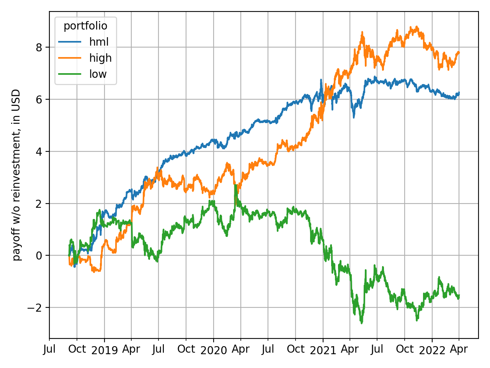

# fx strategies in cryptocurrency space

(how) does carry trade work in the crypto universe?

I investigate if the simple carry trade strategy is implementable in the cryptocurrency space and provide instructions and fully replicable code to replicate my findings; using data from the Kraken exchange, I show that sorting cryptocurrencies on the analogue of the fiat interest rate results in a statistically and economically meaningful excess returns and Sharpe ratios; my finding thus adds another asset to the universe of those where the carry trade anomaly is pronounced.

go to [walkthrough](./walkthrough.ipynb) for results.



## requirements
there are some tests which will be passed once the rest of this section has been 
dealt with:
```bash
python -m unittest discover
```

**first**, environment variable `PROJECT_ROOT` must point to the project folder; 
you can set it in the .env file, and python will rely on `python-dotenv` to set it.

**second**, the necessary virtual environment can be created from `requirements.txt`: 
```bash
python3 -m venv .venv; source .venv/bin/activate; pip install -r requirements.txt
```
to create a virtual environment in `$PROJECT_ROOT/.venv` and install all packages;
please don't forget to activate it every time!

**third**, package [foolbox](https://github.com/ipozdeev/foolbox) must be downloaded to where 
python can find it.

**fourth**, a certain data folder layout must be adhered to; you can create it with
```bash
make data_dir_layout
```

**fifth**, you have to download
spot and perpetual futures prices from Kraken: 
- download the five [.zip archives](https://support.kraken.com/hc/en-us/articles/360047124832-Downloadable-historical-OHLCVT-Open-High-Low-Close-Volume-Trades-data) 
of spot prices from 'Separate ZIP files' &ndash; one for each cryptocurrency &ndash; and place them in `data/raw/spot/kraken/`;
- download all .csv.zip archives following the link [here](https://support.kraken.com/hc/en-us/articles/360022835871-Historical-Data)
and place them in`data/raw/perpetual/kraken/`;

```bash
$ ls data/raw/spot/kraken
BCH_OHLCT.zip
ETH_OHLCT.zip
LTC_OHLCT.zip
XBT_OHLCT.zip
XRP_OHLCT.zip
```

```bash
$ ls data/raw/perpetual/kraken
matches_history_2018-01.csv
matches_history_2018-02.csv
...
```

after this the following should work when run in the command line:
```bash
make prepare_data
```

this will create several .ftr (feather) data files in `data/prepared/spot(perpetual)/kraken/` 
that are used by functions from `src.datafeed_.kraken.downstream`
 